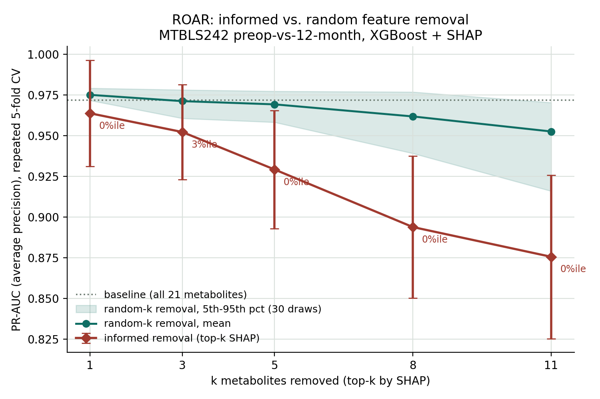
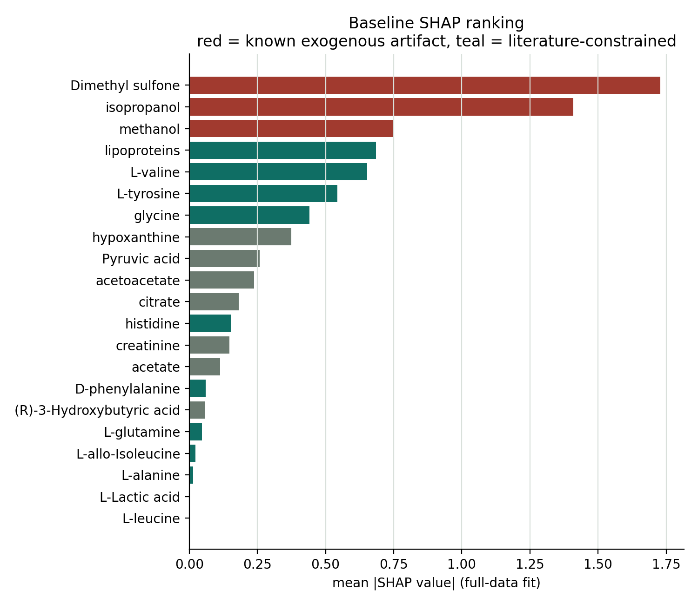

# ROAR: ทดสอบความซื่อสัตย์ของคำอธิบายโมเดล (RemOve And Retrain)

โจทย์: ตัวชี้วัดทางชีวภาพที่โมเดล AI บอกว่า "สำคัญที่สุด" (ผ่าน SHAP) เป็นสัญญาณที่จำเป็นจริง
(irreplaceable) หรือแค่บังเอิญมีความสัมพันธ์ทางสถิติกับสัญญาณจริงที่ซ่อนอยู่ในตัวแปรอื่น (proxy)?
งานนี้ทดสอบด้วยวิธี **ROAR (RemOve And Retrain)** — ลบเมแทบอไลต์ที่ SHAP บอกว่าสำคัญที่สุดออกจาก
ชุดข้อมูล แล้วเทรนโมเดลใหม่ตั้งแต่ต้น (ไม่ใช่แค่ mask ตอน inference) เพื่อดูว่าประสิทธิภาพเปลี่ยนไป
แค่ไหน เทียบกับการลบตัวแปรแบบสุ่มจำนวนเท่ากัน

ทำได้ทั้งหมดด้วยข้อมูลสาธารณะ **ไม่ต้องเก็บข้อมูลผู้ป่วยใหม่เลย**

## ต่อยอดจากอะไร

งานนี้ต่อยอดโดยตรงจาก [Chaiporn2005/Forecast](https://github.com/Chaiporn2005/Forecast)
โฟลเดอร์ `Bridge_ai_summit_nmr_2026` (Experiment A — obesity screening จาก MTBLS242 NMR) ใช้
**ข้อมูล, label, สถาปัตยกรรมโมเดล และชุด monotonic constraint ชุดเดียวกันทุกประการ** ไม่ได้ปรับแก้
อะไรจากต้นฉบับ — ROAR ถูกเพิ่มเข้ามาเป็นชั้นการประเมินความน่าเชื่อถือของ SHAP ranking ที่มีอยู่แล้ว

## ข้อมูล

[MetaboLights MTBLS242](https://ftp.ebi.ac.uk/pub/databases/metabolights/studies/public/MTBLS242/)
(bariatric surgery cohort, serum ¹H-NMR), ไฟล์ `m_MTBLS242_v2_maf.tsv` และ `s_MTBLS242.txt` เก็บไว้ใน
`data/` เหมือนต้นฉบับ (public data, ตรวจ hash ไว้ใน `results/protocol.json`)

- label = **1 (obese/preop)**: n = 106, **0 (healthy/12 เดือนหลังผ่าตัด)**: n = 71
- 21 เมแทบอไลต์, แปลงด้วย `log1p`
- โมเดล: XGBoost (`max_depth=3`) พร้อม monotonic constraint จากวรรณกรรม obesity/insulin-resistance
  metabolomics (11 จาก 21 ตัวถูก constrain — เหมือนต้นฉบับทุกประการ ดู `src/data.py`)

## วิธีการ (ROAR protocol)

1. **Baseline** — repeated stratified 5-fold CV (10 รอบ = 50 folds) วัด PR-AUC (average precision)
   แล้ว fit โมเดลเดียวกันบนข้อมูลทั้งหมดเพื่อคำนวณ SHAP ranking (ใช้เพื่อจัดอันดับเท่านั้น แยกจากการ
   ประเมินผล ป้องกัน circularity)
2. **Checkpoints k = 1, 3, 5, 8, 11** — เลือกจากความหมายจริง ไม่ใช่ตัวเลขสุ่ม: k=1 คือฟีเจอร์อันดับ 1,
   k=3 คือกลุ่มสารปนเปื้อนที่รู้จักครบสามตัว (isopropanol/methanol/Dimethyl sulfone), k=8 คือจำนวน
   ฟีเจอร์ทิศทาง "เพิ่ม" ทั้งหมดที่ถูก constrain, k=11 คือฟีเจอร์ที่มีหลักฐานวรรณกรรมรองรับทั้งหมด
   (บังคับให้โมเดลเหลือแต่ 10 ฟีเจอร์ที่ไม่มีทิศทางกำหนดไว้)
3. **Informed removal** — ลบ top-k ตาม SHAP ranking แล้ว **retrain จริงทุกครั้ง** ด้วย
   hyperparameter ชุดเดิมทุกประการ (ตรึงไว้ไม่ให้ tune ใหม่ต่อเงื่อนไข เพื่อให้ PR-AUC ที่เปลี่ยนไป
   สะท้อนเนื้อหาข้อมูลที่หายไป ไม่ใช่ผลจากการ tune ใหม่)
4. **Random-removal control** — สุ่มลบ k ฟีเจอร์ 30 ครั้งต่อ checkpoint (ใช้ CV เบากว่าเล็กน้อย: 3 รอบ
   x 5 fold แทน 10 รอบ x 5 fold เพื่อคุมเวลาคำนวณ — บันทึกไว้ชัดเจนใน `protocol.json`) แล้วดูว่า
   informed removal ตกอยู่ตำแหน่งเปอร์เซ็นไทล์ที่เท่าไหร่ในการแจกแจงนี้
5. **Proxy detection** — retrain บนฟีเจอร์ที่เหลือ, รัน SHAP ใหม่, ดูว่าฟีเจอร์อันดับ 1 ใหม่คือตัวไหน
   แล้วคำนวณสหสัมพันธ์ (Pearson) กับฟีเจอร์ที่ถูกลบไป เพื่อยืนยันว่าเป็น "ตัวแทน" จริงหรือไม่
6. **Contrast: artifact vs. biology** — เทียบผลการลบ "สารปนเปื้อนที่รู้จัก 3 ตัว" กับ "เมแทบอไลต์ตาม
   วรรณกรรมที่ SHAP สูงสุด 3 ตัว" โดยตรง เพื่อดูว่า ROAR แยกสองกลุ่มนี้ออกจากกันได้ชัดแค่ไหน

## ผลลัพธ์



| k | ฟีเจอร์ที่ลบ | Informed PR-AUC | Random PR-AUC (mean ± SD) | Percentile ของ informed ใน random |
|---:|---|---:|---:|---:|
| 1 | Dimethyl sulfone | 0.964 | 0.975 ± 0.003 | 0% |
| 3 | + isopropanol, methanol | 0.952 | 0.971 ± 0.007 | 3.3% |
| 5 | + lipoproteins, L-valine | 0.929 | 0.969 ± 0.006 | 0% |
| 8 | + L-tyrosine, glycine, hypoxanthine | 0.894 | 0.962 ± 0.012 | 0% |
| 11 | + Pyruvic acid, acetoacetate, citrate | 0.876 | 0.953 ± 0.019 | 0% |

(baseline ทุกฟีเจอร์ = 0.972 ± 0.024, 50 folds; ตารางเต็มอยู่ใน `results/roar_curve.csv`)



### สิ่งที่พบ

**1. Baseline ยืนยันปัญหาเดิมเชิงปริมาณ.** SHAP อันดับ 1–3 คือ Dimethyl sulfone, isopropanol,
methanol — ตรงกับสารปนเปื้อนที่ Bridge_ai_summit ระบุไว้แล้วว่าเป็น exogenous artifact (isopropanol
คือน้ำยาฆ่าเชื้อผิวก่อนผ่าตัด) ตรงเป๊ะ 100%

**2. ผลตรงข้ามกับสมมติฐานตั้งต้น.** คาดไว้ก่อนรันว่าลบสารปนเปื้อนออกน่าจะหา "ตัวแทน" ได้ง่าย (เพราะไม่
ใช่ชีววิทยาจริง) แต่ผลจริงคือ informed removal อยู่ที่เปอร์เซ็นไทล์ 0–3.3% ของ random removal **ทุก
checkpoint** — คือแย่กว่าเกือบทุกการสุ่มลบ 30 ครั้ง ไม่ใช่แค่สารปนเปื้อนเท่านั้น แม้แต่ตัวที่ SHAP จัดว่า
สำคัญก็ยาก จะหาตัวแทนในชุดข้อมูลนี้ (n=177 ตัวอย่าง, cohort-extremes design ที่ทำให้มี redundancy
ระหว่างฟีเจอร์ค่อนข้างน้อย)

**3. Proxy detection เผยรายละเอียดที่น่าสนใจกว่า.** ลบ Dimethyl sulfone (k=1) ตัวเดียว → โมเดลหันไปใช้
**isopropanol** เป็นอันดับ 1 แทน (ยังเป็นสารปนเปื้อนอยู่ดี ไม่ใช่ชีววิทยา) ต้องลบสารปนเปื้อนให้ครบทั้ง 3
ตัว (k=3) โมเดลถึงหันไปใช้ **L-valine** (BCAA ซึ่งเป็น real obesity marker ตามวรรณกรรม) เป็นอันดับ 1
แทน — แปลว่าสัญญาณปนเปื้อนมีลำดับสำรองกันเองอยู่ 3 ชั้น ต้องเอาออกให้หมดก่อนชีววิทยาจริงจะโผล่ขึ้นมา
(ดู `results/proxy_detection.csv`)

**4. Contrast ยืนยันว่าสารปนเปื้อน "แทนยากกว่า" ชีววิทยาจริงเล็กน้อย** — ลบกลุ่มสารปนเปื้อน 3 ตัว ได้
PR-AUC 0.952 (เปอร์เซ็นไทล์ 3.3%) ส่วนลบกลุ่มชีววิทยาจริงสูงสุด 3 ตัว (lipoproteins, L-valine,
L-tyrosine) ได้ PR-AUC 0.961 (เปอร์เซ็นไทล์ 6.7%) — สารปนเปื้อนเจ็บกว่านิดเดียว ไม่ใช่เจ็บน้อยกว่าอย่าง
ที่คาด (ดู `results/contrast_artifact_vs_biology.csv`)

### การตีความ — นี่คือประเด็นหลักของงานนี้

ผลลัพธ์ทั้งหมดชี้ไปที่ข้อสรุปเชิงระเบียบวิธีที่สำคัญกว่าตัวเลขตัวใดตัวหนึ่ง: **"หาตัวแทนไม่ได้" (ROAR
percentile ต่ำ) ไม่ได้แปลว่า "เป็น biomarker ทางชีวภาพจริง" เสมอไป** ในชุดข้อมูลนี้ สารปนเปื้อนที่รู้แน่ชัด
ว่าไม่ใช่ชีววิทยาก็ยังผ่านเกณฑ์ "หาตัวแทนไม่ได้" เหมือนกับชีววิทยาจริง (หรือแม้กระทั่งแทนยากกว่าเล็กน้อย)
เหตุผลที่เป็นไปได้คือสัญญาณจากสารปนเปื้อนเป็นตัวแปรที่ผันแปรตามช่วงเวลาการเก็บตัวอย่าง (preop มีการ
ฆ่าเชื้อผิวหนัง, 12 เดือนไม่มี) แบบเกือบสมบูรณ์และไม่มี noise ทางสรีรวิทยาปนอยู่ ในขณะที่เมแทบอไลต์ทาง
ชีวภาพจริงมีความแปรปรวนระหว่างบุคคลสูงกว่า จึงมีความซ้ำซ้อน (redundancy) กับฟีเจอร์อื่นมากกว่า — ทำให้
"แทนยาก" กลายเป็นสัญญาณของ **ความเป็น shortcut ที่สะอาด** ได้พอๆ กับสัญญาณของ **ความเป็นชีวภาพจริง**

สรุปคือ **ROAR percentile เพียงอย่างเดียวไม่พอสำหรับตัดสินว่า biomarker ใดจำเป็นทางชีวภาพจริง**
จำเป็นต้องใช้ควบคู่กับความรู้โดเมน (แบบเดียวกับที่ทีมงานเดิมรู้อยู่แล้วว่า isopropanol คือน้ำยาฆ่าเชื้อ)
เสมอ — นี่คือสิ่งที่งานนี้พิสูจน์เชิงปริมาณ ไม่ใช่แค่ยืนยันสมมติฐานตั้งต้นที่ตั้งไว้ก่อนรัน

## ข้อจำกัด

- ทำเฉพาะ **Experiment A (obesity, MTBLS242)** เท่านั้น เพราะข้อมูลดิบของ NHANES (Experiment B) และ
  MTBLS1 (Experiment C) อยู่นอกรีโปต้นฉบับ (อ่านจาก absolute path ของโปรเจคแม่ที่ไม่ได้อยู่ในสภาพ
  แวดล้อมที่ใช้รันงานนี้) — ยังสรุปข้ามโรค/ข้าม modality ไม่ได้
- random-removal control ใช้ CV เบากว่า informed removal (3 รอบ vs 10 รอบ) เพื่อคุมเวลาคำนวณ อาจทำให้
  ค่าเฉลี่ยของ random distribution มีความแปรปรวนสูงกว่าที่ควรเล็กน้อย
- เปอร์เซ็นไทล์ต่ำสุดที่วัดได้คือ 1/30 ≈ 3.3% (informed ที่ "0%" คือแย่กว่า random ทั้ง 30 ครั้ง ไม่ได้
  แปลว่าน้อยกว่า 0% จริง) เพิ่มจำนวน random draws จะละเอียดกว่านี้ได้
- n = 177 ตัวอย่างเป็น cohort เดียว ผลนี้จำเพาะกับชุดข้อมูล/โมเดลนี้ ยังไม่ใช่ข้อสรุปทั่วไปเกี่ยวกับ ROAR
  ในฐานะวิธีวัด faithfulness
- patient ID กู้คืนไม่ได้เหมือนข้อจำกัดเดิมใน Forecast repo, same-patient fold leakage ตัดออกไม่ได้ทั้งหมด
- นี่คือ interpretability study ไม่ใช่การยืนยันประสิทธิภาพทางคลินิก และไม่ได้แทนที่ external validation

## แผนต่อไป

- ขยายไปทำ Experiment B (NHANES/T2DM) และ Experiment C (MTBLS1/T2DM) เมื่อเข้าถึง raw data ได้
- เพิ่มจำนวน random draws (>30) และให้ CV เท่ากับ informed removal เพื่อความแม่นยำของเปอร์เซ็นไทล์ที่
  ปลายหาง
- ทำ ROAR แบบเดียวกันกับโมเดล responder (`monotonic logistic`) ใน `MTBLS242_forecast` ของรีโปต้นฉบับ

## วิธีรันซ้ำ

```bash
pip install -r requirements.txt
python src/roar_experiment.py     # ~1.5-2 นาที, เขียนผลลง results/
python src/make_figures.py        # เขียนกราฟลง figures/
python src/verify_results.py      # ตรวจสอบความสอดคล้องภายในทั้งหมดอิสระจากสคริปต์หลัก
```

ทุก seed ถูกตรึงไว้ (`src/model.py`, `src/roar_experiment.py`) และ `results/protocol.json` เก็บ
sha256 ของไฟล์ข้อมูลต้นทาง + เวอร์ชันไลบรารีทั้งหมด รันซ้ำแล้วได้ผลเดียวกันทุกครั้ง (ตรวจแล้วสองรอบ)

## โครงสร้างไฟล์

```
data/                            ไฟล์ข้อมูล MTBLS242 ต้นฉบับ (เหมือนใน Forecast repo)
src/
  data.py                        โหลด/เตรียมข้อมูล + constraint set
  model.py                       XGBoost config ตรึงไว้ + repeated CV
  roar_experiment.py             สคริปต์หลัก: baseline, ROAR, proxy detection, contrast
  make_figures.py                วาดกราฟจากผลใน results/
  verify_results.py              ตรวจสอบความสอดคล้องภายในอิสระ
results/
  baseline_shap_ranking.csv
  roar_curve.csv
  random_draws_raw.csv           คะแนนดิบของการสุ่มลบทั้ง 30 ครั้งต่อ k (ตรวจสอบย้อนหลังได้)
  raw_fold_scores.csv            คะแนนดิบทุก fold ของทุกเงื่อนไข
  proxy_detection.csv
  contrast_artifact_vs_biology.csv
  protocol.json                  seed, เวอร์ชันไลบรารี, hash ไฟล์ข้อมูล, เวลารัน
figures/
  roar_curve.png
  baseline_shap_ranking.png
```

## Data provenance

ไฟล์ `m_MTBLS242_v2_maf.tsv` และ `s_MTBLS242.txt` ดาวน์โหลดจาก
[MetaboLights MTBLS242 public FTP](https://ftp.ebi.ac.uk/pub/databases/metabolights/studies/public/MTBLS242/)
เหมือนกับที่ระบุไว้ใน [Chaiporn2005/Forecast](https://github.com/Chaiporn2005/Forecast)

**หมายเหตุการอัปโหลด:** ไฟล์ข้อมูลดิบ 2 ไฟล์ใน `data/` และรูปภาพ 2 ไฟล์ใน `figures/` (PNG) ยังไม่ได้
อัปโหลดผ่านหน้าเว็บ GitHub เนื่องจากเป็นไฟล์ไบนารี/ขนาดใหญ่ที่พิมพ์ผ่านตัวแก้ไขข้อความไม่ได้ — รันคำสั่ง
ในหัวข้อ "วิธีรันซ้ำ" ด้านบนเพื่อสร้างไฟล์เหล่านี้ขึ้นมาเอง (ข้อมูลดิบก็อปปี้มาจาก `Chaiporn2005/Forecast`
ได้โดยตรง) หรือรอการเชื่อมต่อ push สิทธิ์เต็มรูปแบบในอนาคต
